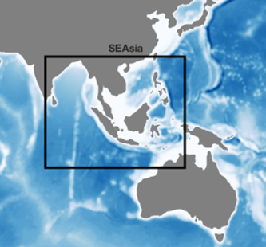

# 🌊 SEAsia NEMO Model Configuration

> **Overview:** Physics-only regional ocean model configuration covering the Southeast Asia (SEAsia) domain.

---

## 🌐 Model details
| Feature | Details |
| :--- | :--- |
| **Model Framework** | **NEMO** (*Nucleus for European Modelling of the Ocean*) |
| **Model Components** | **Physics Only** (Hydrodynamics) |
| **Spatial Domain** | **Southeast Asia (SEAsia)** |
| **Horizontal Resolution** | **1/36°** (approx. **3 km** grid spacing) |
| **Vertical Coordinate System** | **z-level and terrain following hybrid** |

---

*Geographic boundaries and domain coverage for the 1/36° SEAsia NEMO configuration.*
