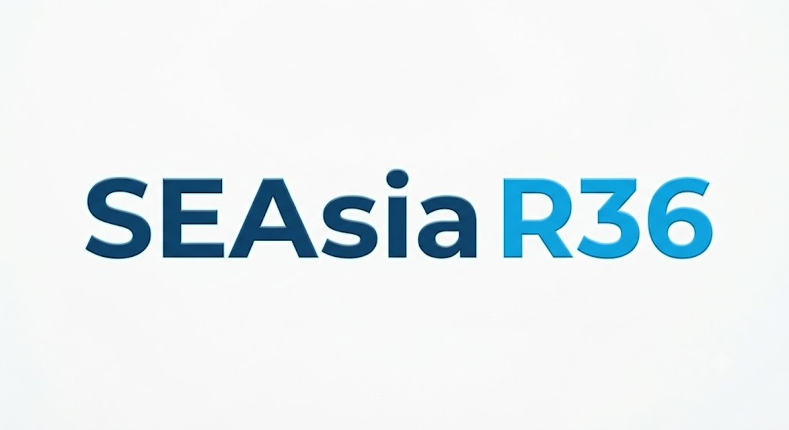

<p align="center">
  
</p>

# South East Asia Ocean Model — SEAsia R36

Welcome to the documentation for **SEAsia R36**. This guide provides explicit, step-by-step instructions for setting up and running the model—from downloading NEMO to completing a full test simulation year.

---

## Getting Started Setup Guide

*Note: The guide is set up for instructions for ARCHER2 HPC, you will have to adjust for your HPC environments (modules, compilers, libraries etc.).*

First clone the SEAsia GitHub repository to your HPC to provide a consistent directory environment with the guide and any start files you may need.
```bash
git clone https://github.com/NOC-MSM/SEAsia_R36.git
cd SEAsia_R36
```

Then, Follow the instructions in the pages below sequentially:

1. **[XIOS](XIOS.md)**  
   Downloading and installing XIOS.

2. **[NEMO](NEMO.md)**  
   Downloading NEMO (version 4.0.4), and creating/compiling your SEAsia configuration.

2. **[INPUT](INPUT.md)**  
   Download the domain and example forcing to run your first experiment.
